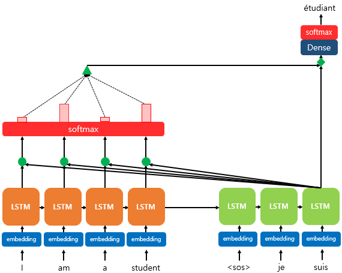
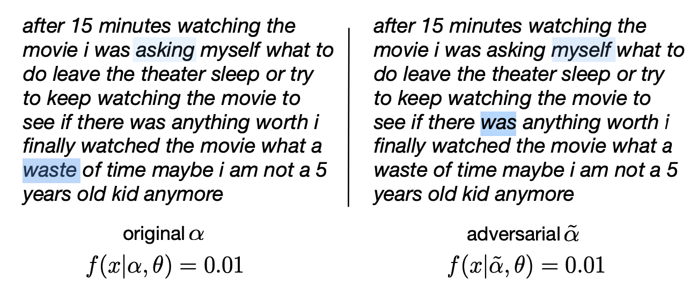
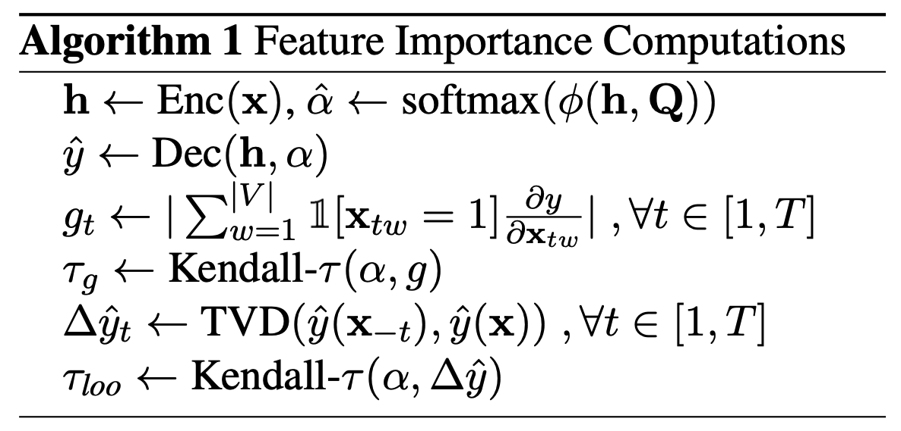
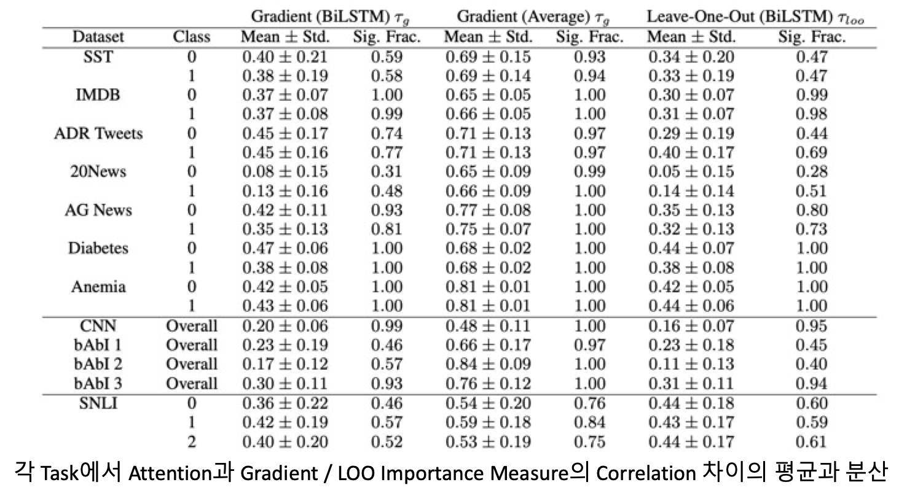
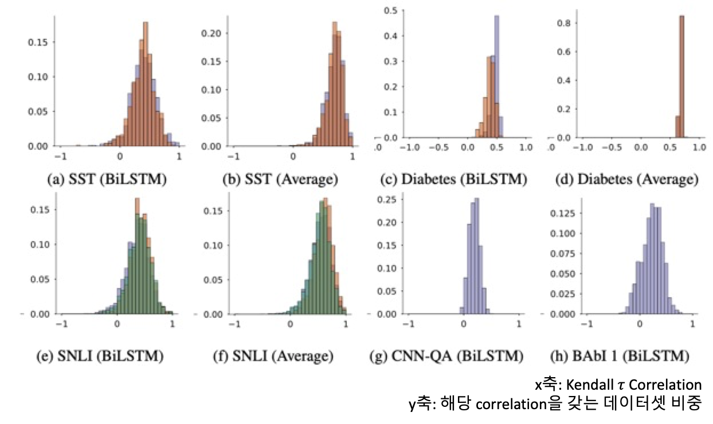
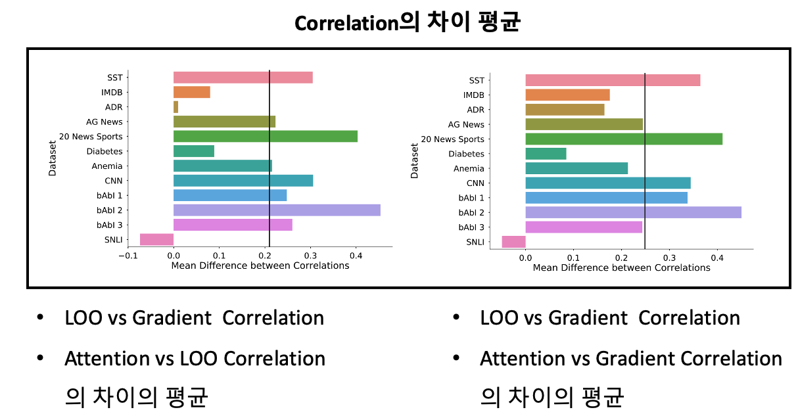
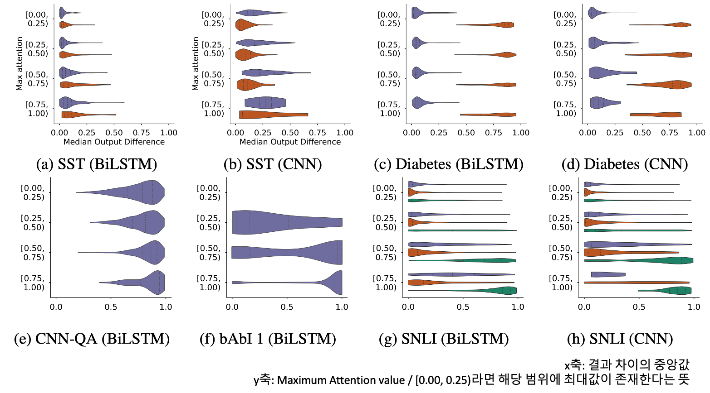
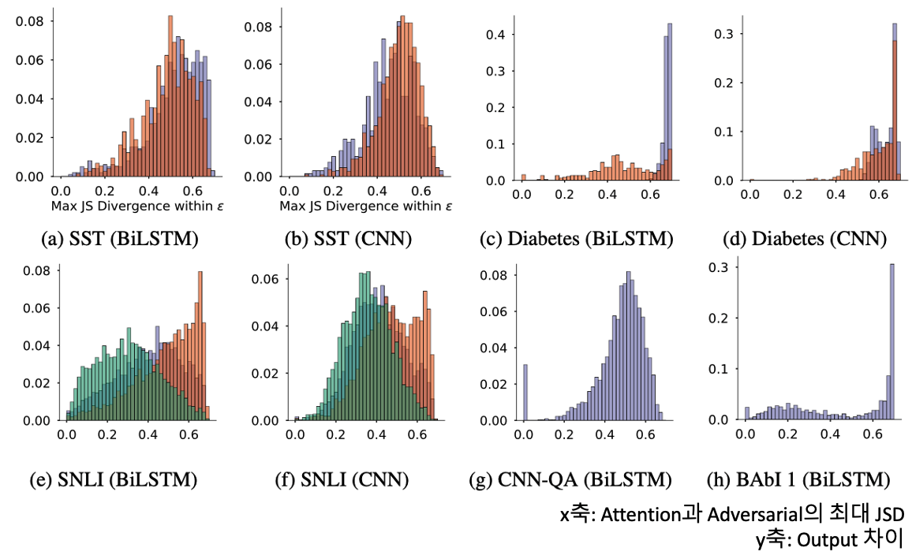
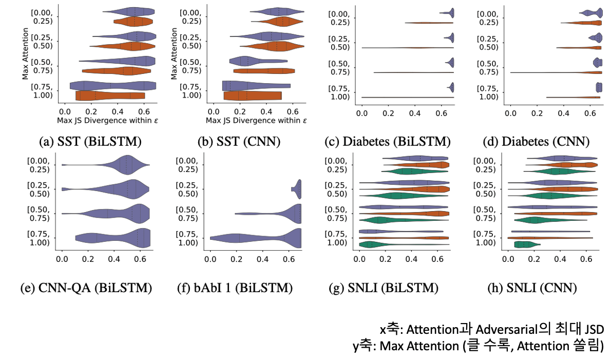

# Attention is not Explanation

> Attention을 통해 모델의 설명력을 얻을 수 있을까?

본 포스트에선 이제는 많이 알려진 Attention의 속성 중 오해하기 쉬울만한 요소에 대해 공유해드리고자 합니다. Attention이란 단어 자체로만 놓고 봐도, '어디에 집중해야 하는가?'에 대한 요소이며, 하나의 단어 또는 토큰이 모델에서 사용되어 의미가 계산이 될 때, 주위 문맥 (Context)에 동등한 가중치를 주지 않고 선택과 집중을 하는 것입니다.  아래의 그림과 같은 번역 Task를 진행할 때, 'suis' 뒤의 어떤 단어가 등장하게 될지를 계산함에 있어 번역 대상 문장인 영어를 살펴보고 어떤 단어에 집중해서 계산할지를 결정하는 것이 Attention이라고 간략하게 말할 수 있겠습니다. 

* **Attention에 대한 정의 및 중요도는 다량의, 양질의 자료들이 넘쳐나기 때문에 개념에 대해서는 자세히 다루지 않겠습니다.**
* **즉, Attention의 개념을 알고 그것의 속성을 아는 것이 본 포스트의 목적입니다.**

Attention은 'Attention is all you need' 논문에서 Transformer의 근간이 되었지만, 그 이전부터 사용된 방법이며 Seq2Seq Task에서 많이 활용되었습니다. 하지만 확실히 Transformer에서 그 두각을 크게 나타냈으며 이후 Pre-trained Model인 BERT로 까지 그 파급력이 이어졌는데 본질적으로 이 모든 것이 가능했던 이유는 Attention이라고 생각합니다. 

소개해드릴 논문이 비교적 전달하고자 하는 메시지는 간단합니다. 

> Attention이 어떤 설명의 효과가 있는지 알아보려 했으나, 결론적으로 설명력을 갖지 못한다.

Attention이라는 것이 기본적으로 훈련이 완료되면 하나의 문장 내의 단어들에 대한 의미를 계산할 때 주위의 정보를 반영하는 전략이라고 소개해드렸는데, 이런 속성으로 인하여 

> Attention을 살펴보면 하나의 단어와 가장 연관있는 단어를 파악할 수 있다 $\rightarrow$ 해당 모델이 특정 결과를 도출해낸 원인을 알 수 있다.

라는 결론을 내게 되었습니다. 많은 논문들이 본 논문 이전에는 **'그렇다 카드라'**로 얘기를 했지만, 실질적으로 평가를 해본 논문이 없었기에 본 논문에서 그것을 다루고자 했고, 결론적으로 Attention이 설명의 효과가 없음을 실험을 통해 나타냈습니다. 

"설명의 효과가 없다"고 말하지 않고 "실험을 통해 나타냈다"라고 말씀드린 이유는 해당 결론이 후에 반박을 가져왔기 때문입니다. 대표적인 논문이 'Attention is not not Explanation'인데 두 논문 모두 각기 NAACL, EMNLP에서 발표된 논문이기에 누가 맞고 틀린지 명확하게 구분하기 어렵습니다. 또한 후발주자인 논문에서도 기존의 논문에 대하여,

* 틀린 거는 아니지만 실험에서 조금 포인트가 벗어난 부분이 있어서 우리는 이렇게 생각한다.
* 설명력이라는 정의를 어떻게 내리냐에 따라서 다르다.

등의 전투적으로 반박한다기 보다 존중을 하는 듯한 느낌을 받았기에 더 모호해진 부분이 있습니다. 즉, Attention을 설명력으로 바라볼 수 있는 여지는 아직 있으며, 연구자들의 관점에 따라 달라지는 양상입니다. 

그럼 본격적으로 Jain and Wallace(2019)가 논문에서 주장한 핵심 내용에 대하여 설명하도록 하겠습니다. 두 가지 핵심 내용이 존재하는데 기본적인 의사 전달의 방식은 반증법 또는 귀류법을 사용하여, **"Attention이 설명력의 자질이 있다면 어떤 특성이 나타야 하는데 그것이 없으므로 모델을 설명할 수 없다"** 라는 자세를 취하고 있습니다. 

* Attention은 Gradient based로 측정한 Feature Importance와 상관성이 없다.
  Attention이 모델 결과를 설명하는 방식 중 하나라면, 다른 방식으로 측정한 설명력과도 어느 정도 상관성이 있어야 하는데 그 수치가 낮으므로 설명이 아님을 의미합니다. 

* 같은 결과 값에 대하여 다른 Adversarial Attention을 생성할 수 있다.
  하나의 모델 결과 값에 대해선 고정된 설명이 존재해야 합니다. 예를 들어, 분류 Task를 통해 아래의 문장을 분류하는 예시를 들어보겠습니다.

  > [CLS] 사랑이 온거야, 너와 나 말이야, 니가 좋아~ 정말 못 견딜만큼

  위의 문장의 [CLS] token으로 분류를 진행했는데 이 때 Attention을 간단하게 유추해보면, '사랑', '좋아' 에 크게 Attention의 가중치가 형성되었을 것입니다. 즉, 문장을 설명하는 Token들이 정해졌는데 이 때 다른 '너', '견딜만큼' 등과 같은 다른 유형이 Attention도 존재한다면 해당 결과를 낼 때 크게 영향을 미쳤던 단어들이 제각각이므로 고정적인 설명을 제시할 수 없게 됩니다. 

  

  위의 예시를 보게 되면, 똑같은 영화 평에 대하여 같은 결과 값, 0.01, 즉 부정으로 분류하였습니다. 좌측이 모델의 Attention을 살펴본 것인데, 해당 Attention에 대한 Adversarial Attention Weight는 우측과 같습니다. 즉, 같은 결과 값에 대하여 다른 Attention을 도출할 수 있게 된 것입니다. 

  

## Research Questions and Contributions

Attention이 과연 모델의 투명성을 제공해줄까? > Faithful Explanation

1. Attention 가중치와 Feature Importance 측정과 얼마나 상관성이 있을까? - Gradient Based / Leave One Out Methods
   정답: 적거나, 일관되지 않게 나타

2. 다른 Attention Weight 이 다른 예측값을 제공해줄까?
   정답: 놉!, 같은 결과를 내는 Adversarial Attention을 생성할 수 있다.
   또한 Attention을 Permute하기만 하더라도 다른 결과를 낼 수 있다.

   

## Experiments

본 논문의 실험은 위에서 지속적으로 언급하는 두 질문을 해소하기 위한 실험입니다. 

1. **학습된 Attention이 다른 방식으로 계산된 Feature Importance와 Correlation이 있는가?**
   실험에서 제시한 'Feature Importance'는 Gradient-based와 leave-one-out 방식이 있습니다. 
2. **다른 Feature에 attend하더라도 예측에 변화가 있는가?**
   같은 결과를 만드는 다른 Attention분포를 생성하기 위하여, 생성된 Attention 분포를 임의로 permute(섞는) 하는 과정을 거칩니다. 사실 이 임의로 섞는 attention이 놀랍게도 같은 결과를 꾸준하게 낼 수 있다고 하는데 이 중 최대로 큰 차이가 나지만 결과가 같은 Attention을 Adversarial Attention이라고 칭합니다. 

각 섹션에 대한 그래프와 표를 보면서 더 자세히 살펴보기 전에 간략히 이해하셔야 할 개념이 있는데 이는 아래와 같습니다. 

* Total Variation Distance (TVD): Output 분포의 차이
  $TVD(\hat{y}_1, \hat{y}_2) = \frac{1}{2}\sum_{i=1}^y\|\hat{y}_{1i} - \hat{y}_{2i}\|$
* Jensen-Shannon Divergence (JSD): 두 Attention 분포의 차이

해당 수치들을 통해 실험을 진행하여 분포의 차이를 보이고 이로써 Attention의 설명력을 보이고자 합니다. 

## Attention과 Feature Importance의 상관성

실험에서 사용한 Feature Importance는 아래의 두 가지입니다. 

* Gradient Based Feature Importance
* Leave one out Feature Importance

### Feature Importance 계산 법

실험은 훈련이 완료된 뒤의 Test 단계에서 진행되므로, 훈련된 Attention Distribution을 고정시킬 수 있는데, 이 때 gradient를 살펴보게 되면 특정 입력에 따라 Output에 어떤 변화가 생길지를 알 수 있기에 설명력으로서의 효과를 볼 수 있으며, Leave one out의 경우는 하나의 입력을 제외했을 때의 결과에 대한 분포의 차이와 Attention 분포의 차이를 살펴보게 됩니다. 

### 각 Feature Importance와 Attention의 상관

수치상으로 살펴보게 된다면, Attention Distribution과 각 Gradient / LOO Importance Measure 사이의 Kendall 상관도가 낮은 편에 속한다고 볼 수 있습니다. Sig. Frac. 는 해당 수치들이 통계적으로 유의함을 보여주는 것인데 대부분의 경우에 높은 값을 나타내 상관성이 있지만 낮음을 입증해주고 있습니다. 

또한 위의 그림을 살펴보게 되면, 대부분의 데이터셋의 Attention과 Gradient 분포의 상관도가 0.5 이하가 대부분의 비중을 갖고 있으며, 그나마 MIMIC Task나 QA Task에서는 상관도가 높게 나타나 있으나, 0.5 근처이기에 그마저도 좀 약한 모습입니다. 

그런데 여기서 추가적인 확인을 하게 되는데, 이는 Gradient와 LOO의 상관성의 유무입니다. 사실 Attention이 이 둘과 상관이 적다고 말하는데 Gradient와 LOO끼리의 상관도 적다면 단순히 모델의 설명력을 나타내는 지표들끼리 모두 각기 다른 방향을 바라보기 때문에 위와 같은 결과가 나타났다고 할 수 있으므로, 완벽한 결론을 위해선 Gradient와 LOO는 상관성이 있는데 Attention과는 없음을 나타내야 합니다. 

위의 그림이 Gradient / LOO / Attention의 상관도 차이의 평균을 나타낸 것입니다. 

* 좌측의 그림은 (LOO와 Gradient의 상관도) & (Attention과 LOO의 상관도)의 평균 차이를 뜻합니다.
  평균적으로 전자의 상관도가 0.2 정도 더 크게 나타납니다. 
* 우측의 그림은 (LOO와 Gradient의 상관도) & (Attention과 Gradient의 상관도)의 평균 차이를 뜻합니다. 
  평균적으로 전자의 상관도가 0.25정도 더 크게 나타납니다. 

즉, 전반적으로 Feature Importance들은 비슷한 분포의 Attention을 갖고 있는 것에 반해, Feature Importance와 Attention의 분포의 꼴은 다르다, 즉 다른 내용에 서로 집중하고 있음을 알 수 있습니다. 

## Counterfactual Attention Weights

다음으로 보인 실험은, 기존 Attention이 낸 Output과 같은 결과를 내지만, 다른 Attention을 생성하는 방식 및 그에 대한 결과를 소개합니다. 

해당하는 Attention을 생성하기 위해 두 가지 방식을 사용하는데,

1. 기존 Attention을 마구 섞어 Random하게 재배치
2. 같은 결과를 도출하나 기존 Attention과 가장 차이 나는 Adversarial Attention 분포 생성

인상적으로 살펴볼 부분은 SST 데이터셋에서 Maximum Attention Value가 높은 경우입니다. 

Maximum Attention Value가 작다는 뜻은, 최대값이 작아 전체 분포가 고르게 퍼져있다고 할 수 있으며,
크다는 뜻은 반대의 경우인 첨도가 매우 높고 단일한 단어 또는 Token에 Attention이 강하게 적용되었다고 할 수 있습니다. 

그런데 Permutation이 진행되었어도 결과 값의 큰 차이가 없다는 뜻은, 분명히 Heatmap으로 Attention을 표현했을 때 특정 단어에 명확하게 강조가 되어 있을텐데, 이것이 다른 단어에 적용되었어도 딱히 달라지는 것은 없다는 말입니다. 연애사에 비유하자면 **'이 사람 없으면 안돼'**가 아니라, **'이 사람이든 저 사람이든 다 똑같다'** 라는 느낌으로 Attention의 진정성이 없다...라고 할 수 있습니다. 진정성이 없어 보이는 사랑은 신뢰할 수 없지요...

### Adversarial Attention

해당 Attention 분포가 존재한다는 뜻 자체가 Attention의 설명력을 부인하는 것입니다. 같은 결과에 대해서는 같은 설명이 존재하여 설명력을 가진다고 표현할 수 있기 때문입니다. Adversarial은 위에서 보인 Random Permutation 중 최대의 차이를 보이는 분포를 뜻합니다. 

Random Permutation을 생성하는 방식은

1. 기존 Attention과 Adversarial을 사용한 각각 Output의 최대 차이 $\epsilon$ 을 정합니다.
2. 해당 $\epsilon$ 이하의 성능 차이를 보이면서 달라지는 Attention을 찾습니다. 
3. $\epsilon$: 분류 Task 에서는 0.01 / QA Task에서는 0.05로 설정

실제 수식은 TVD와 JSD를 사용하며 복잡한 구조를 보이지만 이는 생략하도록 하겠습니다. 

위의 그림은 기존 Attention과 Adversarial의 최대 JSD를 나타내는데, 0.69를 최대로 잡은 해당 분포에서 Output 차이가 모든 JSD에서 낮게 나타나는 것을 볼 수 있습니다. 

만약에 기존 Attention이 골고루 퍼져있다면, 같은 결과를 도출하는 분포를 생성하는 것은 그렇게 어렵지 않을 것입니다. 분포의 값들을 약간씩 변동해도 전체적인 모양에 변화가 적기 때문입니다. 하지만 특징적인 값에 Attention이 쏠려있다면 해당 분포는 개성이 강하기 때문에 변화를 시키게 된다면 전혀 다른 Attention 분포가 될 것이기에, Output이 크게 변화하지 않은 범위 아래에 그런 분포가 존재할 수 있을 지가 의심되기는 합니다. 

이에 위와 같은 실험을 진행했을 때, 기존 Attention의 Peak가 존재하던, 그렇지 않던 왠만하면 Max JSD가 비슷하게 나타나는 것을 볼 수 있기에, 기존 Attention의 모양에 따라 Adversarial의 생성에 방해가 되지는 않는다 라고 할 수 있습니다. 

## 결론

본 논문에서는 일련의 실험들을 통해 Feature Importance와 Attention의 상관이 적음을 나타냈으며, Attention의 Adversarial을 생성하여 동일한 결과를 내는 분포를 나타내어 Attention의 부족한 설명력을 증명했습니다. 즉, Attention이 현재 NLP에서 좋은 성능의 원인임을 기정 사실이나, 이것이 해석에 도움을 주는 것은 아니며 심지어 우리가 생각한 방식대로 작동하는 매커니즘이 아닐 수도 있다는 생각이 듭니다. 

본 실험의 한계는 다음과 같습니다.

* Gradient와 LOO를 Attention과의 비교군으로 삼기는 했지만, 이것들이 'Ground Truth'의 역할을 하는 것은 아니다. 
* Attention의 탄생 배경인 Seq2Seq Task는 시행하지 않았다. 하지만 설명력을 요하는 Task는 분류가 좀 더 적합하지 않나 생각한다.
* Adversarial Attention이 기존 Attention의 설명력이 없음을 나타내지만서도, 복수개의 설명일 수도 있다.

확실히 Attention이 생성되는 메커니즘으로 인하여 대중들이 Attention을 자신의 모델을 설명할 수 있는 도구로써 활용해도 문제가 없다고 생각할 수 있습니다. 하지만, 해당 논문의 결과로 봤을 때는 Explainability의 가정 아래 사용이 불가한 것은 아니지만, 다른 수단을 통해 설명을 진행해보는 것이 더 좋을 것 같습니다. 

저는 본 논문도 재밌게 읽었지만, 해당 논문이 가져온 역학이 매우 재밌다고 생각합니다. 본 논문을 반박하거나 지지하는 논문들이 많이 등장하여 아직도 확실히 결과가 정해지지 않은 Debate 거리이기 때문입니다. 따라서 관련 논문들을 최대한 많이 읽은 뒤 저 만의 결론을 내보는 것을 시도하면 좋을 것 같습니다. 

긴 글 읽어주셔서 감사합니다.