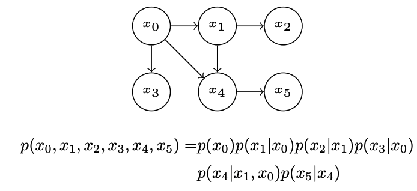
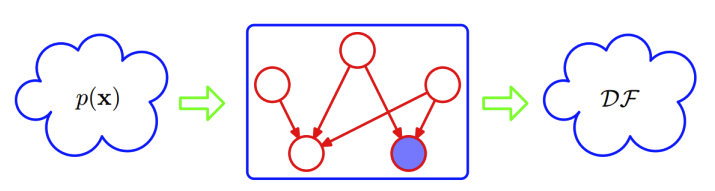
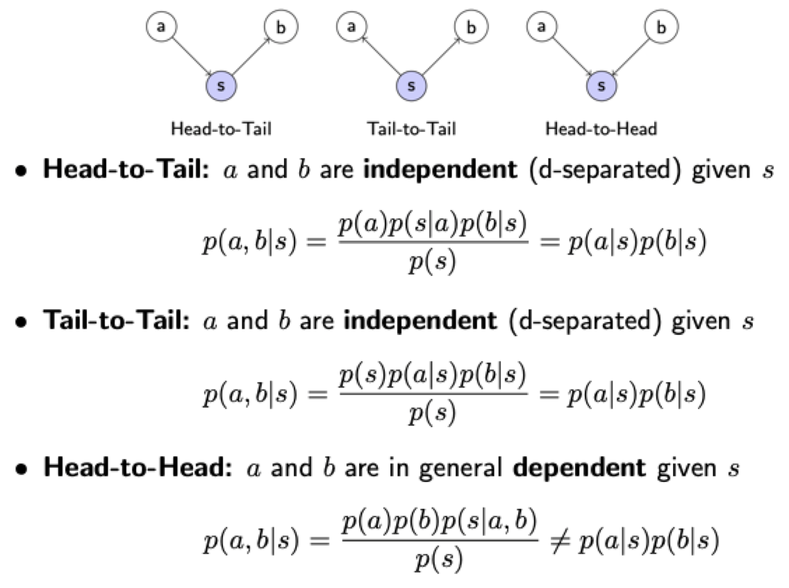

# Structured Probabilistic Models for Deep Learning

Structured Probabilistic Model: 확률 분포를 표현하는 방법이며, 분포 내의 Random Variable들의 상호 관계를 그래프로 표현한다.

이 때 Graph를 통해 그 관계를 표현하며, Vertex와 Edge간의 연결을 표현한다.

* Scale이 큰 확률 모델에 대한 문제점들

* Graph를 통해 확률 분포의 구조를 표현하는 방법

* Graph는 기본적으로 복잡한 구조를 띄기 때문에 ,

  * Node들의 관계성
  * 어떤 Graph 구조가 최적일지

  판단해야 한다. 

## 16.1 The Challenge of Unstructured Modeling

딥러닝의 목적 자체가 머신러닝에서 다루지 못하는 고차원 데이터를 효율적으로 다루기 위함.

분류 알고리즘을 진행할 때, 예를 들어 이미지를 분류하는 경우, 수 많은 픽셀들이 요약되어 정보들을 소실하고 한 데 모아 하나의 값으로 표현.

확률 모델로 다른 Task 도 가능한데 분류보다 빡세다

* Density Estimation: x input에 대한 true density p(x)를 구하고자 함
* Denoising: Damaged $\tilde x$ 에 대해서도 정확한 x를 return 한다.
* Missing value imputations
* Sampling: 확률분포 $p(x)$를 나타낸 뒤 Sample을 추출

그런데 이런 확률 분포를 구성함에 있어 Random Variable이 매우 많으면 힘들다. 32 x 32 image에 대한 Binary image 분포만 계산해도 매우 복잡한 경우의 수가 나타난다. 

Random Vector x에 대하여 n개의 Variable이 존재하고, 각 Variable마다 k개의 값들이 존재한다면, 

P(x)를 나타내는 것에 $k^n$의 파라미터가 필요하다.

* Memory:
* Statistical Efficiency:
* Runtime: the cost of inference
* Runtim: the cost of sampling

Table Based Approach는 모든 종류의 interaction을 반영하는데에 반면, 실제 생활에서 마주하는 확률 분포는 Indirect Influence가 많은데 이를 제거하여 Structured 확률 모델로 변경하여 파라미터 개수를 줄인다. 

즉, 결합분포를 구성함에 있어 모든 경우의 수를 사용하는 방법 대신, 관계에 대한 Prior를 통해 파라미터 수를 줄이는 것을 목표로 한다고 볼 수 있다.
그 중, 간접적인 영향을 배제하고 직접적인 영향만을 그래프로 표현하는 방식을 진행하며, 직접적인 영향을 주는 관계를 제외한 관계는 Independent하다고 할 수 있다.

하지만 Undirected의 경우는 Indirect한 관계도 포함하고 있다고 추측하고 있다.

## 16.2 Using Graphs to Describe Model Structure

SPM은 RV간의 상호작용을 표현하기 위하여 그래프를 사용

각 Edge는 직접적인 Interaction을 표현하는 것이다. 물론 그 사이에 간접적인 상호작용도 스멀스멀 포함되어 있긴 하지만 모델에 표현하는것은 Direct Interaction이다!

이 상호작용을 표현하는 방식은 그래프 내에서 여러가지가 존재

* Model Based on Directed Acyclic Graphs
* Model Based on Undirected Graphs

### Directed Models (Belief Network / Bayesian Network)

Alice, Bob, Carol의 계주를 예로 들면 $t_0$에 따라 $t_1$에 영향을 미친다. 

a에서 b로 화살표를 그었다는 것은 b의 확률 분포를 a에 대한 조건부 확률로 구성하겠따는 뜻이며, b가 a에 dependent!

Directed Graphic Model에서 $x$는 directed acyclic graph $\mathcal G$ 에서 각 변수의 Parent를 표현한다.

$p(x_i \| P_{a_\mathcal G}(x_i))$

$p(t_0, t_1, t_2) = p(t_0)p(t_1\|t_0)p(t_2\|t_1)$

오호 그럼 Structured가 Unstructured에 비해 갖는 강점은 무엇인가?

시간을 0~10분을 6초 chunk로 나타내면 100개의 variable을 갖는다.

그럼 결합분포 $p(t_0, t_1, t_2)$에 대하여 100 x 100 x 100의 곱으로 나타낼 수 있는데...

각 $t_0, t_1, t_2$는 finishing time이며, 각자 뛴 시간이 아니다. 따라서 Dependent한 거야!

즉, Variable의 Parent가 적을 수록 Graph내에서 표현하는 확률분포의 파라미터 개수가 매우 적다.

결합분포는 각 확률 변수들의 Conditional Distribution으로 나타낼 수 있으며, 연결이 안 된 부분은 Conditional Independence를 띄고 있다고 할 수 있다. 다음과 같은 예시를 보면 된다.

$p(x_2\|x_1, x_0) = p(x_2\|x_1)$

$p(x_3\|x_2, x_1,x_0) = p(x_3\|x_0)$

 재밌는 사고중 하나는, 이런 Directed Graph를 하나의 Filtering으로 보는 것이다. 이를 통해 결합분포를 구성하는 수 많은 경우의 수 중에 Directed Graph로 나타낸 경우로 한정시키는 것으로 Filtering을 가능하다고 보는 것이다. 

### Undirected Models (Markov random fields / Markov Networks)

물론 많은 경우에서 상호 연관성의 방향을 파악할 수 있지만, 모든 관계의 방향을 파악하기는 힘들다. 즉, 변수 간의 Causality가 명확하게 파악이 될 때!

나로 인해 roommate와 coworker의 감기가 전달될 수 있으므로, 양방향성의 관계가 성립한다. 이 때는 Directed가 아니기 때문에 Conditional Distribution으로 표현하지 않는다.

Notation

$clique \ \mathcal C$내에서의 변수들 간의 affinity를 측정하며 Clique는 두 Variable의 관계를 의미한다. 

coworker와 you 모두 healthy한 경우가 가장 affinity가 높고, 둘다 병들었을 때가 두번째로 높고, 각기 아플때가 가장 낮다.

Similar Factor를 구성해야 한다.

### 16.2.3 The Partition Function

Partition Function을 통해 확률의 합을 1로 맞추도록 Normalize

### 16.2.4 Energy Based Models

Energy Function의 뜻은 두 (X, Y) 쌍이 존재할 때 공존할 확률이 높다면 에너지를 낮게 주고, 반대의 경우 에너지를 높게 주는 정의라고 할 수 있다. Clique Potential은 각 변수들의 Affinity를 측정하며, 그 식을

* $\tilde p(x) = \prod_{\mathcal C \in \mathcal G}\phi(\mathcal C)$

* $\tilde p(x) = exp(-E(x))$

$exp$의 곱은 모두 덧셈으로 나타낼 수 있음

Seperation Means

중간의 변수가 확정되는 순간, 양 쪽의 변수가 Indirect Influence에서 벗어난다.

# D-Separation

