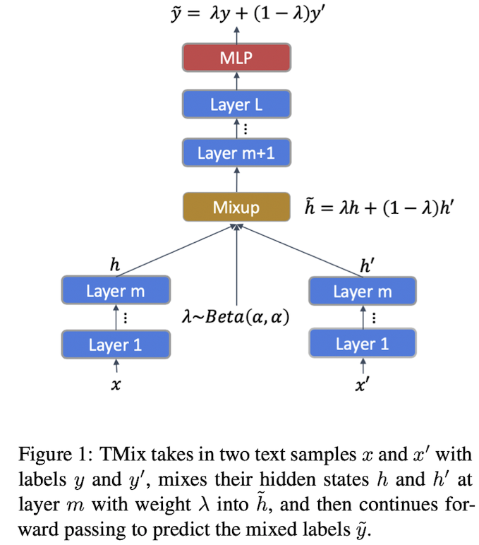
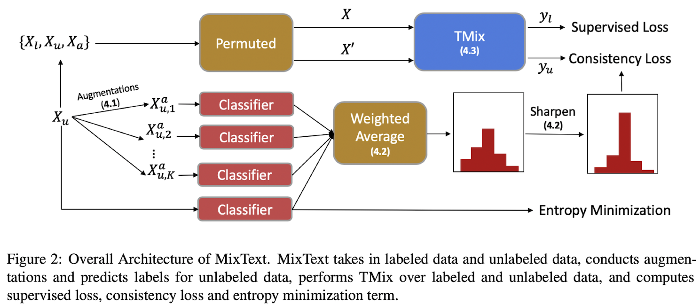
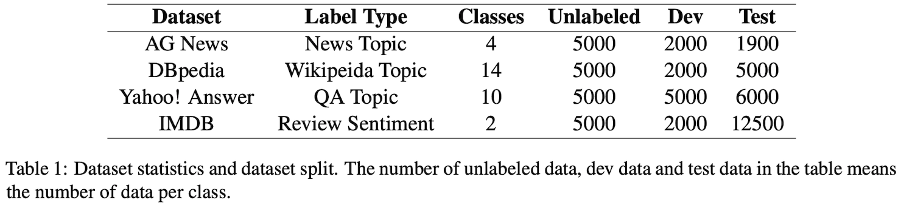
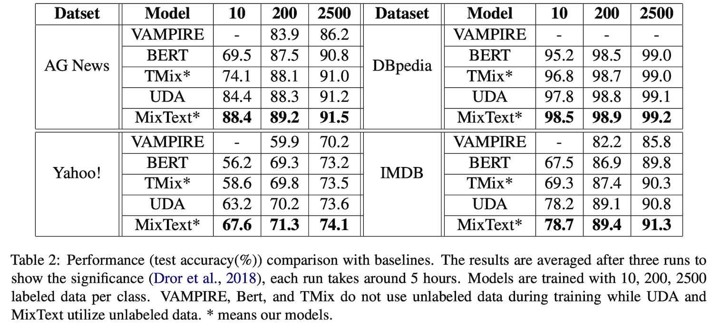
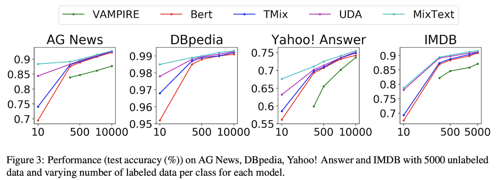
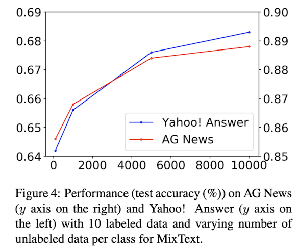
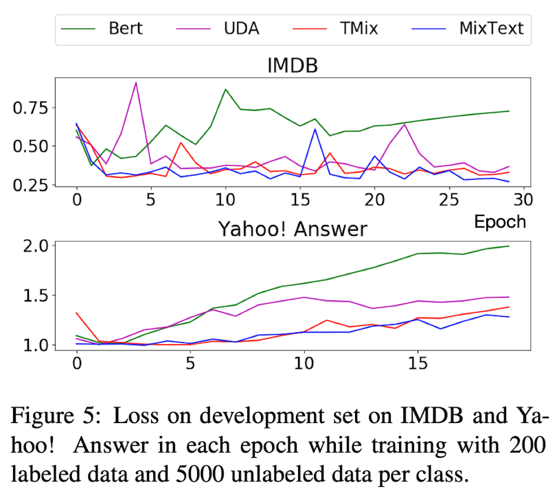

# MixText

## Semi-supervised Learning
Supervised Learning을 진행할 때, Label Data가 적으면 over-fitting이 나타날 위험이 매우 크다. 적은 데이터로 훈련된 모델을 활용해 실제 추론 시 예상과는 다른 결과가 나타난다는 뜻이다. 이는 Labeled Data의 개수를 늘리면 되면 해결되는 문제긴 하지만 시간, 비용 측면에서 데이터를 준비하는 것은 어렵다. 따라서 Semi-supervised Learning은 Unlabeled Data 역시 훈련에 참여시키는 방식으로 데이터 수를 증폭시키며 어떻게 Unlabeled Data를 효율적으로 활용할 지에 대한 기법을 연구한다.

Unlabeled Dataset을 활용해 Semi supervised Learning을 하는 것이 모델의 성능 향상에 도움이 되는 경우가 많지만 특정 조건을 만족해야 한다. 대표적인 세 가지 조건은 아래와 같다.
1. **Smoothness Assumption**: 확률 밀도가 높은 지역의 입력 값 $x_1, x_2$가 가깝다면, 각각의 레이블 $y_1, y_2$ 역시 가깝다.
2. **Low-density Assumption**: 모델의 결정 경계가 데이터의 확률 밀도가 높은 곳을 지나지 않는다.
3. **Manifold Assumption**: 고차원의 입력 데이터가 저차원 공간에서 특정한 구조(Manifold)를 따라 놓여있다.

지금까지의 Semi-supervised Learning은 다음과 같이 분류할 수 있다. 

Method 별, 적용하는 데이터 셋 별로 나눌 수 있으며, 본 포스트에서는 Consistency Regularization을 활용하는, 그리고 이미지와 텍스트에 적용하는 Semi-supervised Learning에 대해서 알아볼 것이다. 

참고로 Text에 대한 Semi-supervised Learning을 아래와 같이 조금 더 자세한 분류의 리스트를 적어두었다. 
1) Variational auto encoder를 사용해 입력 문장을 재구성하는 과정 속에 있는 Latent Variable을 통해 문장의 Label을 예측한다.
2) Self-training
3) Consistency Training (Adversarial Noise / Data Augmentation)
4) Large Scale Pretraining & Fine-tuning $\sim$ BERT

먼저 Image 데이터에 대한 모델인 MixMatch를 간략히 살펴보고, 이어서 UDA를 살펴본 뒤, MixText를 자세하게 설명해보겠다. 

이런 일련의 모델들은 Label 데이터와 Unlabeled 데이터를 분리해서 활용하게 된다. 간단하게 BERT에 대한 예시를 들면, Pretraining에서는 Label이 필요 없고 Fine-tuning때는 Label이 갖춰진 데이터를 통해 훈련이 진행되는 모습과 같다. 이는 결국 Labeled Data에 Overfit이 될 가능성이 농후하다는 뜻이다.

이를 방지하기 위해 본 논문에서 제시하는 기법이 바로 **TMix Augmentation**이다. 사실 TMix는 저자들이 완전히 새롭게 제안하는 것이 아니라 Image Classification에서 많이 활용되었던 **Mixup**을 Text에 적용한 것이다 (**T**ext **Mix**up $\approx$ **TMIX**). TMix를 사용했다고 해서 바로 MixText가 되는 것은 아니며, 이를 활용한 Semi-supervised Learning 기법이 MixText이며 추가적으로 전체 아키텍쳐 내에 효과적으로 TMix를 활용하는 방법을 추가된 것이다. 

추가 요소

* Self-target Prediction
* Entropy Minimization
* Consistency Regularization
* Back Translations

## Related Works

### Data Augmentations for Text

데이터 증강은 컴퓨터 비전에서라면 꽤 쉽게 구성될 수 있다. 이미지의 위치 변경, 줌 인/ 아웃, 회전, 뒤집기, 왜곡, 명암 조정 등 이미지를 살짝만 바꾸는 과정으로 데이터량을 비약적으로 증가시킬 수 있다. 하지만 Text에서의 증강은 Syntatic 또는 Semantic Structure를 고려하면서 진행해야 하기 때문에 난이도가 높다. 

Wei and Zou(2019): Synonym replacement, Random Insertion, Random Swap, Random Deletion

Kumar et al. (2019): 

Xie et al. (2019): Back Translations

## TMix

Mixup의 정의

Mixup의 역할: Data Augmentation, Regularization

두 문장 $x$와 $\hat x$ 에 대하여 Mixup을 진행할 때, m번째 Layer에서 딱 한 번 Mixing을 진행한다. 결과적으로 Unlabeled Data인 문장 두 개의 은닉 표상들을 섞고, 두 문장의 정답인 Label 역시 섞어서 혼합 입력이 맞춰야 하는 대상으로 설정한다. 

## 4. Semi-supervised MixText

* $X_l = {x_1^l, ..., x_n^l}$
* $Y_l = y_1^l, ..., y_n^l$
* $X_u = {x_1^u, ...,x_m^u}$

**TMix는 Labeled Dataset에 대한 Augmentation이다! (사실 Augmentation이 본디 Label이 있어야 가능한 것이다)**

TMix는 입력 x와 정답 label y의 쌍을 갖춤으로써 사용이 가능하며 그를 통해 모델 훈련을 더 다양하게 진행할 수 있다. 하지만 Semi-supervised의 본 목적은 사실 Unlabeled Dataset을 활용하는 것인데 그에 대한 활용 방안이 제시되어 있지 않다. 

* 즉, Unlabeled Dataset에서는 Label이 없으므로 $\hat y$를 구성할 수 없으므로, **Label Guessing**이라는 방법을 통해 Unlabeled Dataset의 Label을 구축하였다. 

* TMix 자체도 Augmentation이지만, x 쌍을 구축하기 위하여 Back Translation이라는 Augmentation 또한 추가하였다. 
* Class의 개수가 많을때 모든 Label에 균등한 확률이 배정된다면, 가장 높은 확률을 나타낸 답이라고 해도 틀릴 가능성이 존재한다. 따라서 특정 Prediction의 확률을 증가시키는 방향으로 정답을 정확하게 맞추는 것을 필요로 하며, 이를 Entropy Minimization Loss로 달성한다. 

### 4.1 Back Translation (이하 BT)

Back Translation이란 문장을 다른 언어로 번역한 뒤 다시 원래의 언어로 번역하는 것을 통해 의미는 유지되지만 형태는 바뀌는 방법을 말한다. 예를 들어 매 영화마다 스파이더맨의 표적이 되는 벤 삼촌 또는 메이 숙모의 명언을 들어보겠다.

>  With great power comes great responsibility $\rightarrow$ 大きな力は大きな責任を伴う

> 大きな力は大きな責任を伴う $\rightarrow$ Great power carries great responsibility.

비록 형태는 달라지기는 했지만, 벤 삼촌께서 하시고 싶으신 말씀에는 변함이 없다. 이런 식으로 같은 의미를 담는 다른 문장을 생성해내는 것이 BT 라고 할 수 있다. 

본 논문에서는 BT를 K번 진행하며, K개의 다른 중간 언어를 활용한다. K=1은 (영 > 일 > 영), K=2는 (영 > 한 > 영)과 같은 식으로 진행한다. 

### 4.2 Label Guessing

Unlabeled Data인 $\mathrm{x_i^u}$과 K개의 Augmentation를 활용하여 Unlabeled Dataset의 Label을 예측한다. 현재 수중에 있는 분류기에 Unlabeled Data와 Augmentation을 모두 입력으로 활용하여 확률 벡터를 내뱉는다. 이에 대하여 가중합을 진행하는데 이 때 가중치들을 조정하여 어떤 데이터 셋의 의견을 더 많이 들을 지를 결정한다. 

Weighted Average를 통해 분포가 지나치게 Uniform해지는 것을 방지해주기 위하여, 예측된 분포에 대하여 Sharpening Function을 추가한다. 

### 4.3 TMix on Labeled and Unlabeled Data

Unlabel Data에 대하여 Label을 얻어내고 Augmentation까지 다 진행한 뒤, X와 Y끼리 모두 더하여 Super Set을 구성한다. 

훈련 과정에서는 x,x'를 X superset에서 추출하고 T

## 5. Experiments

### 5.1 Dataset and Preprocessing

**Datasets**

* AG News
* BPpedia
* Yahoo! Answers
* IMDB

Unlabeled Dataset에 대하여 BT를 적용할 때, 독일어와 러시아어를 사용하였으며 FairSeq를 사용했다. Random Sampling Temperatures는 0.9를 사용.

### 5.3 Model Setting

$\lambda$ 는 Beta 분포에서 추출하며, Beta 분포는 $\alpha$ 를 파라미터로 갖고 있다. 알파 파라미터를 적게 줄수록 람다가 0.5에 가깝게 추출되고, 크게 줄수록 람다가 0.1에 가깝게 설정이 된다. 

Labeled Data가 각 class마다 100개 정도만이 존재할 때, 즉 데이터 량이 적을 때 알파를 큰 수인 2또는 16으로 설정하며 이는 람다를 0.5에 가깝게 설정할 것이다. 즉, 두 문장이 골고루 섞이게 되어 data augmentation으로서의 "newer" 데이터가 구축되게 된다. 

반대로 데이터량이 좀 더 많아 각 class당 200개 정도 존재하게 된다면 알파를 0.2, 0.4 정도로 설정하게 되고 람다를 0.1에 가깝게 나타나게 된다. 따라서 람다 0.1은 두 문장 중 다른 하나와 매우 유사한 문장을 나타내게 될 것이며 단순 noise를 추가한 정규화 정도의 역할을 할 것이다. 

### 5.4 Results

5000개의 Unlabeled Data와 10~10000개의 Labeled Data를 통해 실험 진행

실험 결과는 위와 같이 MixText가 기존 기법들보다 더 좋은 성능을 나타내는 것을 볼 수 있다. 

간단 정리

* VAMPIRE보다 다른 모델들이 더 큰 모델을 사용하기에 성능이 더 좋다.
* TMix는 Labeled Data 개수가 적을수록 BERT보다 좋은 성능
* UDA가 TMix보다 좋은 성능을 나타내는데 그 이유는 더 많은 데이터와 consistency regularization loss가 추가

**Labeled Dataset 개수 향상**

**Unlabeled Dataset 개수 향상**

**Overfitting 방지 가능?: Loss on Development Set**

적은 숫자의 Labeled Dataset으로 인하여 Overfitting이 발생할 수 있다는 것을 서두에서 언급하였다. 그렇다면 Mixing의 방식으로 Overfitting을 방지할 수 있는가를 살펴보기 위해 Development Set의 Loss를 판단한다. 

결과를 보다시피 파란색의 MixText와 주황색의 TMix가 UDA보다 낮은 Development Set Loss를 보여주고 있으며 Epoch이 증가할수록 Loss가 함께 증가하지 않는 모습을 보이고 있습니다. 